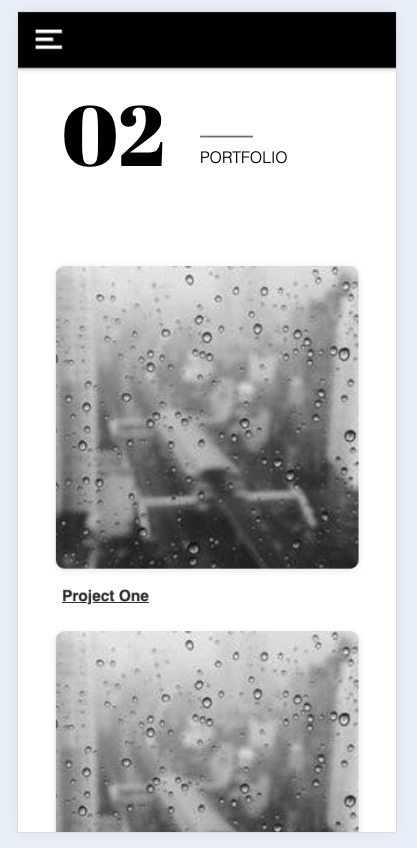

# Arrianne O'Shea - Portfolio Task

​
[My portfolio site] https://arrianne.github.io
​

## Project Requirements

### Content

- ✅ At least one profile picture
- ✅ Biography (at least 100 words)
- ✅ Functional Contact Form (well..this is not at all functional yet.)
- ✅ "Projects" section
- ✅ Links to external sites, e.g. GitHub and LinkedIn.

### Technical

- ✅ At least 2 web pages.
- ✅ Version controlled with Git
- ✅ Deployed on GitHub pages.
- ✅ Implements responsive design principles.
- ✅ Uses semantic HTML.

### Bonus (optional)

Add a short paragraph describing the features below, if you included any.

- x Different styles for active, hover and focus states. - Did not actually finish this for all links.
- ✅ Include JavaScript to add some dynamic elements to your site.

#### wireframes

#### hero - mobile

#### Hero - desktop

#### About me - mobile

#### About me - Desktop

#### portfolio - mobile

#### portfolio - Desktop

#### Contact - mobile

#### Contact - Desktop

#### Still to do....

I really want to make it more accessible so will be updating alt tags in html etc.
I want to expand the homepage to include a skills section and add a bit more fun stuff in the about section.
I want to add a 'fun mode' toggle button at the top which will add more colour an pazazz to my overall site.
I want to add hover states to nav links.

My list could probably go on and on and on..
